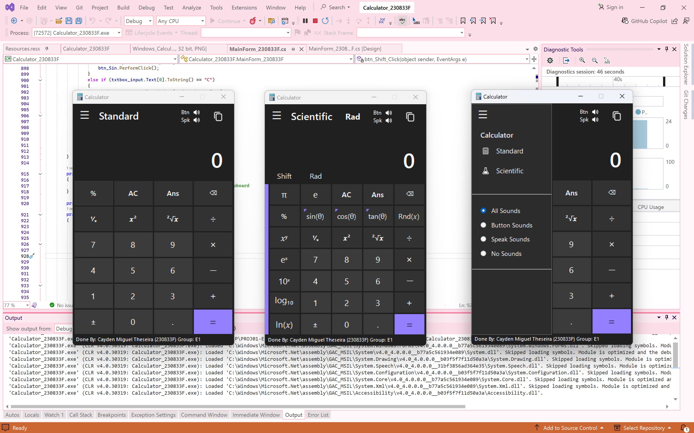

# Calculator Enhancement

## Overview
This project enhances the functionality of a calculator application built using **WinForms** and **.NET Framework 4.8**. The enhancements include a refined user interface, audio features, improved interaction, and added functionality for both standard and scientific calculations.



---

## Features

### A. User Interface
- **Compact Design**: Streamlined layout with well-placed buttons.
- **Hamburger Menu**: Access additional options via a collapsible panel.
- **Mode Switching**: Toggle between Standard and Scientific interfaces.
- **Color Scheme**: Carefully selected colours for better usability.

### B. Audio Enhancement
- **Button Sounds**: Provides auditory feedback for button clicks (both on-screen and keyboard).
- **Result Announcement**: Announces the calculation result audibly.
- **Independent Controls**: Enable or disable speech and button sounds independently via the panel.

### C. Interaction Enhancement
- **Copy Button**: Fully functional copy button.
- **Status Indicators**: Display the status of:
  - Degree/Radian (Deg/Rad)
  - Standard/Scientific Mode (STD/SCI)
  - Button and Speaker sounds (mute/unmute)

### D. Functional Buttons
- **Standard and Scientific Calculations**: Includes basic and advanced functions.
- **Shift Button**: Unlocks secondary functions.
- **Degree/Radian Toggle**: Switch between angle measurement modes.
- **ANS Button**: Retrieve the result of the previous calculation.
- **Dynamic Panel**: Adjusts button layout for Standard/Scientific modes.
- **Keyboard Input**: Accepts input from the physical keyboard.

### E. Additional Features
- **Unary Operators**: Added functions for inverse trigonometry, rounding, and `x^y`.
- **Constants**: Includes Pi (π) and Euler’s number (e).
- **Dynamic Layout**: Seamless transitions between Standard and Scientific modes.
- **Boot-Up Sound Effect**: Plays a sound during application startup.
- **Error-Free Editing**: Allows character deletion without breaking equation evaluation.

---

## Installation
1. Clone this repository:
   ```bash
   git clone https://github.com/your-username/calculator-enhancement.git
   ```
2. Open the project in Visual Studio.
3. Build the solution using the **Release** configuration.
4. Run the application by executing the compiled `.exe` file located in the `bin/Release` folder.

---

## Usage
Enjoy a feature-packed calculator for all your mathematical needs. Switch between Standard and Scientific modes with ease, customize the sound settings, and use the enhanced interaction features for a smooth user experience.

---

## Contributing
Contributions are welcome! Feel free to submit issues or pull requests for additional features or bug fixes.

---

## License
This project is licensed under the [MIT License](LICENSE).

---
